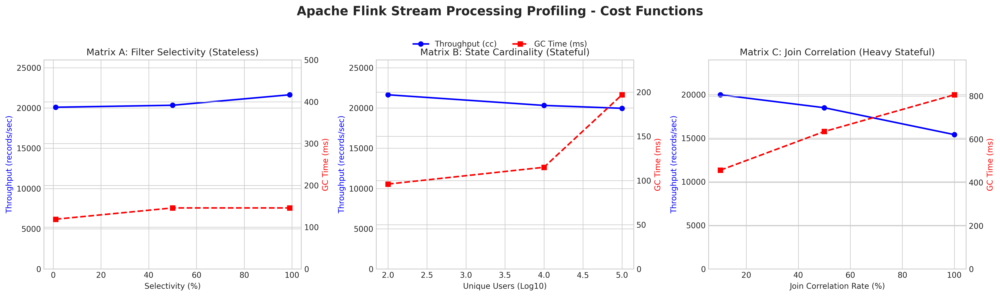

# Apache Flink Stream Processing Profiler
### Thesis Research — Parametric Cost Functions for Data-Intensive Architecture Design

> **Context:** This repository contains the benchmarking infrastructure developed as part of a Master's thesis on *semi-automatic design methodology for Data-Intensive Architectures*. The goal is not to determine which system is "best", but to produce **parametric cost functions** that an optimizer can consume to automatically select the right execution engine (Database, Batch, or Stream Processing) for a given workload described in a high-level SDL (Scenario Description Language).

---

## Table of Contents

- [Background and Methodology](#background-and-methodology)
- [Architecture Overview](#architecture-overview)
- [Repository Structure](#repository-structure)
- [Prerequisites](#prerequisites)
- [How to Run](#how-to-run)
- [Experimental Results](#experimental-results)
- [Key Findings](#key-findings)
- [Implementation Notes](#implementation-notes)

---

## Background and Methodology

### The Research Goal

The broader research project defines a pipeline where a user describes their application in SDL, which is automatically translated into physical *building blocks* (ADL — Architecture Description Language: Filter, Group By, Join, etc.) and then assigned to an execution engine. This assignment is driven by **cost functions** that model how each engine behaves under different workload parameters.

This repository profiles the **Stream Processing engine** (Apache Flink + Kafka) and extracts three parametric cost functions, one per operator class.

### The Dual Streaming Model

Following the Dual Streaming Model theory, stream processing operators are classified by their memory access pattern:

| Class | Representative Op | State | Cost Driver |
|---|---|---|---|
| **Stateless** | Filter | None | Volume × Selectivity |
| **Stateful** | Aggregation | Unbounded changelog | Volume × State Cardinality |
| **Heavy Stateful** | Regular Join | Bilateral unbounded state | Volume × Join Correlation |

### Backlog Processing Technique

To measure the **maximum sustainable throughput** (`cc` — computational cost) without being limited by the producer, we use the *backlog processing / catch-up* technique:

1. A Python Kafka producer pre-fills the topic at ~19,000–20,000 msg/s (hardware-limited).
2. Flink is launched with `scan.startup.mode = earliest-offset` and a `blackhole` sink to eliminate write overhead.
3. Flink consumes the backlog at the maximum physical speed of the hardware.
4. Prometheus scrapes the `numRecordsOut` metric from the Source operator every 5 seconds; `max_over_time` over a 3-minute window isolates the true processing plateau.
5. JVM GC time (`G1 Young + G1 Old Generation`) is captured via `increase()` over the same window as a proxy for memory pressure.

---

## Architecture Overview

```
┌─────────────────────────────────────────────────────────────────┐
│                        Docker Compose Stack                     │
│                                                                 │
│  ┌──────────────────┐    ┌─────────────────────────────────┐    │
│  │  kafka_generator │───▶  Kafka (KRaft, 4 partitions)        
│  │  (Python)        │    │  topics: sensor_events          │    │
│  │                  │    │          purchases              │    │
│  │  Parameters:     │    └──────────────┬──────────────────┘    │
│  │  - --events      │                   │ earliest-offset       │
│  │  - --users       │                   ▼                       │
│  │  - --selectivity │    ┌─────────────────────────────────┐    │
│  │  - --join-rate   │    │  Apache Flink 1.18.1            │    │
│  └──────────────────┘    │  JobManager + TaskManager       │    │
│                          │                                 │    │
│                          │  Q1: Filter (Stateless)         │    │
│                          │  Q3: Aggregation (Stateful)     │    │
│                          │  Q4: Regular Join (H. Stateful) │    │
│                          │                                 │    │
│                          │  Sink: blackhole (no I/O cost)  │    │
│                          └──────────────┬──────────────────┘    │
│                                         │ JMX metrics           │
│                                         ▼                       │
│                          ┌─────────────────────────────────┐    │
│                          │  Prometheus (scrape: 5s)        │    │
│                          │  + extract_metrics.py           │    │
│                          │  → results.csv                  │    │
│                          └─────────────────────────────────┘    │
└─────────────────────────────────────────────────────────────────┘
```

---

## Repository Structure

```
progetto-tesi/
├── docker-compose.yml          # Full stack: Kafka (KRaft), Flink, Prometheus
├── Dockerfile                  # Custom Flink 1.18.1 image with PyFlink + connectors
├── prometheus.yml              # Prometheus config (5s scrape interval)
│
├── jobs/
│   └── flink_benchmark.py      # PyFlink job — Q1 (Filter), Q3 (Agg), Q4 (Join)
│
├── scripts/
│   ├── kafka_generator.py      # Parametric producer: volume, cardinality, selectivity, correlation
│   ├── extract_metrics.py      # PromQL scraper → results.csv
│   └── plot_results.py         # Matplotlib visualization → tesi_grafici_flink.png
│
├── run_experiment.sh           # Single experiment runner (with Flink RUNNING wait-poll)
├── run_matrix.sh               # Full matrix automation (A + B + C)
│
└── results/
    ├── results.csv             # Raw benchmark output
    └── tesi_grafici_flink.png  # Cost function plots
```

---

## Prerequisites

- Docker and Docker Compose
- Python 3.8+ with `kafka-python`, `requests`, `matplotlib`, `pandas`
- The Flink Web UI is exposed on `localhost:8081`
- Prometheus is exposed on `localhost:9090`

```bash
pip install kafka-python requests matplotlib pandas
```

---

## How to Run

### Run the full matrix (all 3 experiments, 9 total runs)

```bash
chmod +x run_matrix.sh run_experiment.sh
./run_matrix.sh
```

This executes all three matrices sequentially and produces `results.csv` and `tesi_grafici_flink.png`.

### Run a single experiment manually

```bash
# Format: ./run_experiment.sh <query_id> <events> <users> <selectivity> <join_rate>

# Matrix A — Stateless Filter, low selectivity
./run_experiment.sh 1 1000000 10000 0.01 0.0

# Matrix B — Stateful Aggregation, high cardinality
./run_experiment.sh 3 500000 100000 0.05 0.0

# Matrix C — Heavy Stateful Join, full correlation
./run_experiment.sh 4 300000 100000 0.05 1.0
```

### Query reference

| ID | Type | Operation | Varied Parameter |
|---|---|---|---|
| 1 | Stateless | `SELECT * WHERE user_id = ?` | Selectivity (1%, 50%, 99%) |
| 3 | Stateful | `SELECT user_id, COUNT(*) GROUP BY user_id` | Cardinality (100 / 10k / 100k users) |
| 4 | Heavy Stateful | `events INNER JOIN purchases ON event_id = related_event_id` | Correlation rate (10%, 50%, 100%) |

---

## Experimental Results

**Hardware:** Single-node Docker deployment (WSL2 on Windows, x86_64)
**Flink version:** 1.18.1 (1 JobManager + 1 TaskManager, default heap)
**Kafka:** KRaft mode, 4 partitions per topic

### Raw Data

| Matrix | Query | Throughput (rec/s) | GC Time (ms) | Events | Users | Selectivity | Correlation |
|---|---|---|---|---|---|---|---|
| A — Stateless | 1 | 20,100 | 119 | 1,000,000 | 10,000 | 1% | — |
| A — Stateless | 1 | 20,345 | 146 | 1,000,000 | 10,000 | 50% | — |
| A — Stateless | 1 | 21,648 | 146 | 1,000,000 | 10,000 | 99% | — |
| B — Stateful | 3 | 21,648 | 96 | 500,000 | 100 | 5% | — |
| B — Stateful | 3 | 20,325 | 115 | 500,000 | 10,000 | 5% | — |
| B — Stateful | 3 | 19,967 | 197 | 500,000 | 100,000 | 5% | — |
| C — Heavy Stateful | 4 | 19,967 | 457 | 300,000 | 100,000 | 5% | 10% |
| C — Heavy Stateful | 4 | 18,484 | 636 | 300,000 | 100,000 | 5% | 50% |
| C — Heavy Stateful | 4 | 15,401 | 806 | 300,000 | 100,000 | 5% | 100% |

### Cost Function Plots



---

## Key Findings

### Matrix A — Stateless Filter: Selectivity is irrelevant to throughput

Throughput is **flat across all selectivity levels** (20,100 → 21,648 rec/s, variation < 8%). This confirms the theoretical prediction: a Flink Filter operator evaluates the predicate on every record regardless of the output cardinality. The CPU cost per record is constant. GC time is negligible (< 150 ms) and stable, consistent with zero state allocation.

**Cost function conclusion:** `cc_filter(selectivity) ≈ constant ≈ 20,500 rec/s`. Selectivity can be dropped as a parameter for the optimizer — it affects *output volume*, not processing capacity.

### Matrix B — Stateful Aggregation: Cardinality degrades GC, not throughput

Throughput remains relatively stable (21,648 → 19,967 rec/s, ~8% degradation) across 3 orders of magnitude of state cardinality (100 → 100,000 unique users). However, **GC time increases monotonically** (96 → 197 ms, +105%), doubling as the state size grows.

**Cost function conclusion:** Flink's RocksDB-based state backend absorbs cardinality growth efficiently at this scale. The optimizer should model cardinality as a GC pressure multiplier rather than a throughput degrader. For very large state (millions of keys), OOM risk becomes the binding constraint, not CPU throughput.

### Matrix C — Heavy Stateful Join: Correlation directly degrades both throughput and memory

This is the most significant result. As join correlation increases from 10% to 100%, throughput drops **from 19,967 to 15,401 rec/s (−23%)** while GC time nearly doubles (**457 → 806 ms, +76%**). The relationship is approximately linear in both dimensions.

The mechanism: a Regular Join in Flink keeps both input streams fully buffered in state. At 100% correlation, every event on the `events` topic generates a join output record — the state backend must handle lookup + match + emit for every single event, doubling the effective work per record compared to 10% correlation.

**Cost function conclusion:** `cc_join(ρ) ≈ 20,000 − 4,600·ρ` where `ρ ∈ [0,1]` is the join correlation rate. GC overhead grows as `gc_join(ρ) ≈ 350 + 460·ρ` ms per 300k-event window. Both functions are suitable as linear approximations for the optimizer in the expected operational range.

---

## Implementation Notes

### Prometheus Metric Selection

- **Throughput:** `max_over_time(sum(rate(numRecordsOut{operator_name=~".*[Ss]ource.*|.*[Kk]afka.*"}[15s]))[3m:5s])` — captures the processing plateau, not the ramp-up.
- **GC Time:** `sum(increase(G1_Young_Generation_Time[2m])) + sum(increase(G1_Old_Generation_Time[2m]))` — uses `increase()` (correct for monotonic counters) instead of `delta()`.

### Join Key Design

Query 4 joins on `event_id = related_event_id` (a 1:1 key), not on `user_id` (which would produce a cartesian-like explosion per user). This ensures the join correlation parameter `ρ` maps linearly to match rate, making the cost function interpretable.

### Known Limitations

- Results are from a single-node Docker deployment on WSL2; absolute throughput numbers will scale differently on bare-metal or multi-node clusters.
- The Aggregation (Q3) uses unbounded state without a TTL, which is an intentional stress test; production deployments would typically use windowed aggregations with bounded state.
- Window Aggregation (`TUMBLE`, `HOP`) is not covered — its cost profile is bounded-memory and would constitute a separate cost function between Stateless and Stateful.